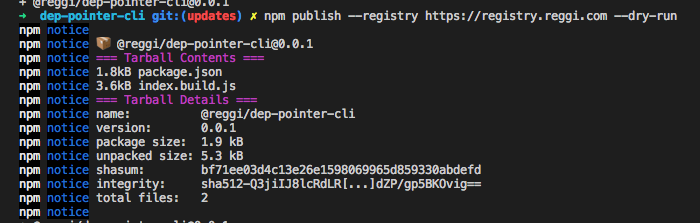
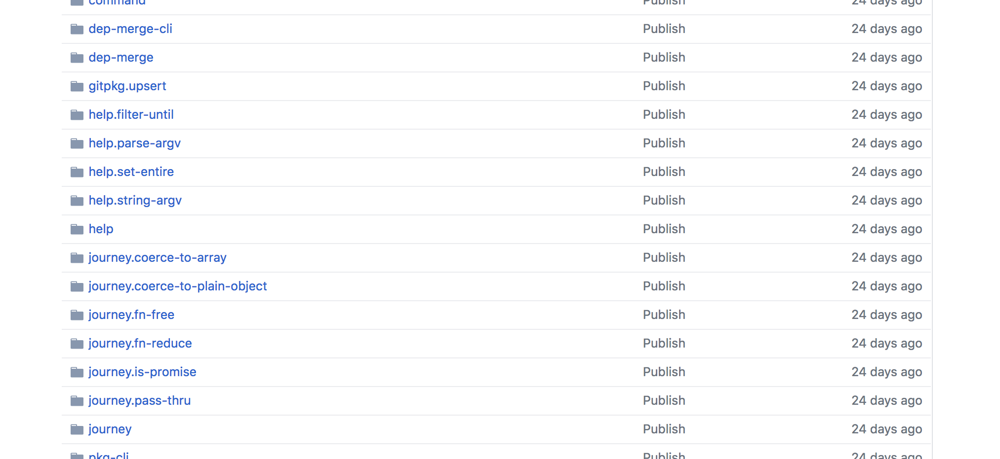
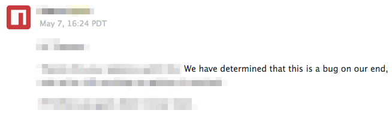
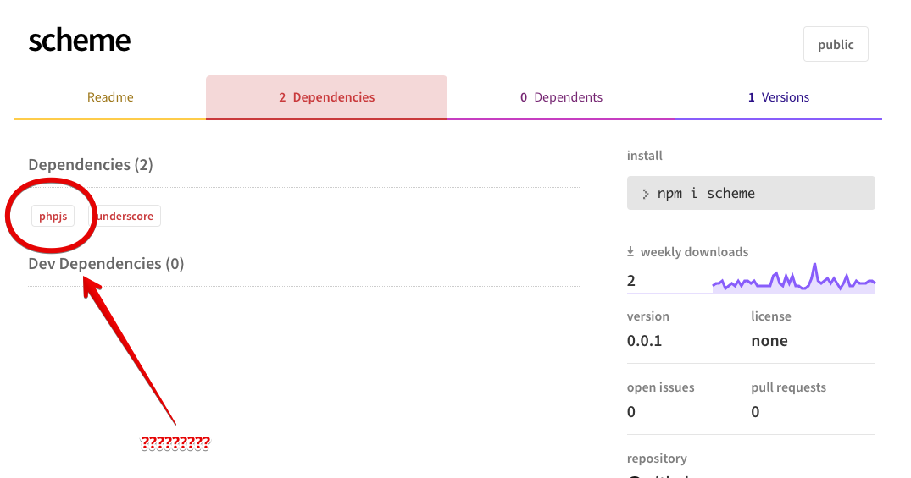

npm modules

---

https://github.com/reggi/npm-modules-talk

---
<center>
Thomas Reggi
</center>

* `@reggi` on github
* `@thomasreggi` on twitter

---


---

<br><br>
why bother creating node modules?
<br><br>

---

1. reusable 
  * `npm i my-mod`
2. versioned (semver)
  * `1.0.0` -> `1.0.1`

---

my dream:

* everything I write to be reusable
* "complete library of every piece of code I write"

---

reuse as much as possibe

* un-exported functions
* functions wrapped in closures
* functions depending on globals
* functions depending on this context

---

un-exported functions 😩


---

this everywhere 🚀


---

<br><br>
how do we create a node module?
<br><br>

---

__Files!__

1. `package.json`
2. `index.js`

---

__`package.json`__

```json
{
  "name": "node-modules-talk",
  "version": "1.0.0",
  "main": "index.js"
}
```

---

__`package.json` with scope__

```json
{
  "name": "@reggi/node-modules-talk",
  "version": "1.0.0",
  "main": "index.js",
  "publishConfig": {
    "access": "public"
  }
}
```

---

__`main.js`__

```js
module.exports = "Hello world"
```

---

now what?

---

publishing!

---

0. About registries
1. `npm login`
2. `npm publish`

---


--- 

__registry flag__

flag:

* `npm login --registry (registry-url)`
* `npm publish --registry (registry-url)`
* `npm set registry http://localhost:4873`

examples:

* https://registry.npmjs.org/
* https://registry.reggi.com/ (proxy)
* http://localhost:4873/ (proxy)

---

__npm login__

```
npm login --registry http://localhost:4873
```

---

__npm publish__

```bash
npm publish --registry http://localhost:4873/
```


---

now that it's publshed what...

1. Check it's available `npm view`
2. Check if it's `requireable`

---

using the `npm view` command

---

__npm view__

```bash
npm view npm-modules-talk --registry http://localhost:4873/
```


---

__npm view version__

```bash
npm view npm-modules-talk version --registry http://localhost:4873/
```


---


---

nope


---

__check our work__


```bash
mkdir check-our-work
```

<hr>

```bash
cd check-our-work
touch index.js
```

<hr>

```bash
npm init -y
```

<hr>

```bash
npm install npm-modules-talk --registry http://localhost:4873/
```

<hr>

```js
const winning = require('npm-modules-talk')
console.log(winning) // should log "Hello world"
```

<hr>

```js
node index.js
```

---

running the node file that uses the node module

```bash
node ./index.js
```


---

<br><br>
pro tips 💅
<br><br>

---

1. `.npmignore`
2. `monorepo`
3. jenkins
4. private registries

---

What is `.npmignore`?

---

Just like `.gitignore` but for `npm`.

```
__snapshots__
coverage
screenshots
examples
index.js
index.test.js
test.js
.pkgrc
.gitignore
example
package-local.json
node_modules
```

---

Tar without ignore:


---

Tar with ignore:



---

What is a monorepo?

---

Everybody loves dragons.


---

single repo many packages



---

each module is small


---

consume your own modules


---

jenkins is your friend


---

run on jenkins

* `depcheck`
* `standard`
* `tests` (with 100% coverage)
* `publish`

---

What is a private registry?

---

issues happen, centralization 🌋🔒😿



---

have a backup.


---

have no fear

---

story time

---

my first node module


---

what it did, was dumb


---

how it did it, was even dumber



---

php?


---

so don't worry! don't fear the `npm publish` command

---

the end

---

https://github.com/reggi/npm-modules-talk
<br>
Thomas Reggi
